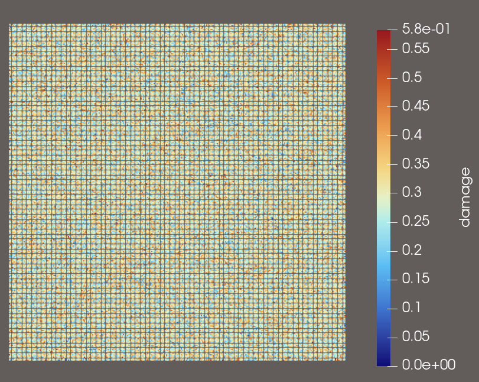

# 📘 Peridynamic Porosity Simulator
*A C++ tool for generating porous pre-damage fields and exporting results as VTK files for visualization in ParaView.*

---

## 🧩 Overview
This project implements a **2D peridynamic porosity simulation**. It creates a particle grid, computes neighbor bonds using a peridynamic horizon, randomly breaks bonds based on a target porosity ratio, and exports per-particle damage values into a **VTK POLYDATA** file.

The resulting `.vtk` file can be visualized in **ParaView**, allowing you to see spatial distributions of porosity and damage.

---

## ✨ Features
- Interactive user-defined parameters  
- Regular 2D particle grid generation  
- Peridynamic neighbor calculation  
- Random bond-breaking based on porosity  
- Local damage computation  
- Export to `.vtk` for visualization  
- Optional automatic ParaView launching on Windows  
- Lightweight and dependency-free

---

## 📸 Example Visualization  
**Porosity Ratio:** 0.1  
**Horizon Factor (m):** 4  
**Grid Size:** 500 × 500 particles  

Below is a visualization of the resulting damage distribution rendered in ParaView:

---
